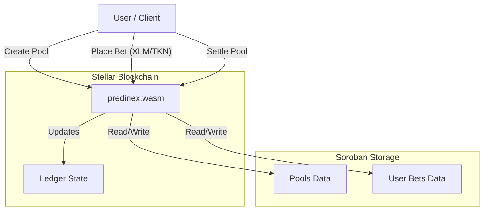
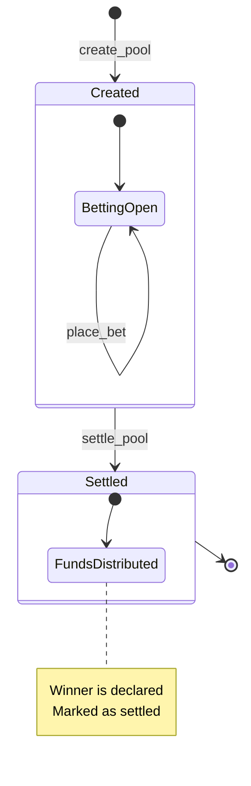

# Predinex Stellar

> Next-generation prediction markets on Stellar (via Soroban).


   

## 🏗 System Architecture

The project centers around the `predinex`,  Soroban smart contract which manages pool states, betting logic, and fund distribution. It utilizes the Stellar Asset Contract (SAC) for secure token transfers.



## 🔄 Workflow

The prediction market lifecycle on Stellar is designed for speed and finality.



## ✨ Features

- **Decentralized Prediction Pools**: Create and manage binary and multi-outcome prediction markets with ease.
- **Fast Settlements**: Leverages Stellar's near-instant finality for rapid results.
- **Cross-Asset Betting**: Compatible with any Stellar asset via the Stellar Asset Contract (SAC).
- **LP Yield Farming**: Deposit liquidity, earn fees, and boost rewards by staking LP shares.
- **Automated Bookkeeping**: Real-time tracking of pool totals and user positions.
- **Rich Web Experience**: A Next.js app with market discovery, portfolio, analytics, comparisons, disputes, and more.
- **Embeddable Widget**: Integrate live pools into any website with a drop-in widget (`packages/widget`).
- **Automation Bot**: Repo-managed off-chain tooling for pool/oracle workflows (`bot`).
- **Robust Security**: Built with Rust and Soroban's secure-by-design architecture.
- **Transparency**: Fully verifiable on-chain data and transaction history.

## 🗂 Repository Layout

- `contracts/predinex` — the core Soroban prediction-market contract (pool lifecycle, betting, settlement, LP incentives).
- `contracts/pool` — related pool utility/auxiliary contract.
- `web` — the Next.js frontend (App Router): markets, dashboard, analytics, admin, disputes, oracle management, portfolio.
- `packages/widget` — the embeddable pool widget for third-party sites.
- `bot` — automated off-chain workflows (oracle reporting, market upkeep).
- `docs` — protocol, contract API, deployment, and development documentation.
- `scripts` — bootstrap and CI/verification helpers.

## 🚀 Getting Started

### Prerequisites

- [Rust](https://www.rust-lang.org/)
- [Stellar CLI](https://developers.stellar.org/docs/build/smart-contracts/getting-started/setup#install-the-stellar-cli)
- [Node.js](https://nodejs.org/) (v18+)
- A Stellar wallet (e.g. [Freighter](https://www.freighter.app/))

### Installation

1. **Clone the repository**
   ```bash
   git clone <repository-url>
   cd predinex-stellar
   ```

2. **Quick Start (Recommended)**

   Run the bootstrap script to install all dependencies and verify your environment:
   ```bash
   ./scripts/bootstrap.sh
   ```

3. **Build the Contract**
   ```bash
   cd contracts/predinex
   stellar contract build
   ```

4. **Run Contract Tests**
   ```bash
   cargo test
   ```

5. **Run the Web App**
   ```bash
   cd web
   npm install
   npm run dev
   ```

## 🛣️ Roadmap

Predinex Stellar ships in phases, growing from core on-chain mechanics to a full product experience.

### Phase 1: Core Soroban Implementation (COMPLETED)
- ✅ Core contract logic (Pools, Bets, Settlement, Cancellation).
- ✅ Multi-outcome pools and template support.
- ✅ LP yield farming with stake boost.
- ✅ Unit test suite for full lifecycle verification.
- ✅ Token integration (SAC).

### Phase 2: Frontend & Product (IN PROGRESS)
- 🔄 Stellar SDK integration.
- 🔄 Wallet and network support are tracked in the canonical [wallet and network support page](./web/docs/WALLET_NETWORK_SUPPORT.md).
- ✅ Market discovery, market detail, and portfolio.
- ✅ Admin, analytics, disputes, oracle management, and comparison tooling.
- ✅ Embeddable pool widget.

## 🤝 Contributing & Releases

We welcome contributions! Please read the [Contributing Guide](./CONTRIBUTING.md) first — it covers local setup, running checks, documentation standards, and the issue/PR workflow.

Additional development guides:
- [Local End-to-End Runbook](./docs/local-runbook.md) — build the contract, deploy to testnet, and wire the web app from a clean checkout
- [Contract API Reference](./docs/contract-api.md) — every public function, data types, auth requirements, fee model, and events
- [Contract Specification](./docs/CONTRACT_SPEC.md) and [API Reference](./docs/API_REFERENCE.md)
- [Deployment Guide](./docs/deployment-guide.md) — build WASM, deploy to testnet/pubnet, initialize, and verify
- [Frontend Development](./web/DEVELOPMENT.md)
- [Frontend Architecture](./web/FRONTEND.md)
- [Release Process](./RELEASE.md)

## 🛠️ CI/CD Pipeline

The project uses GitHub Actions to ensure code quality and prevent regressions. The workflow runs on every push and pull request to `main`.

### Preview Deployments

Pull requests automatically generate preview deployments for the web app, making it easy to review UI changes:

- 🚀 **Automatic**: Every PR with web changes gets a live preview
- 🔗 **Shareable**: Preview URLs are posted as PR comments
- 🔒 **Safe**: Previews use testnet configuration only
- ⚡ **Fast**: Deployments complete in ~2 minutes

**Setup Guide**: See [Preview Deployments Guide](./docs/preview-deployments.md) for configuration instructions.

**Full Documentation**: [Preview Deployments Guide](./docs/preview-deployments.md)

### Local Verification

You can run the same checks locally to verify your changes before pushing:

**Web App:**
```bash
cd web
npm run lint
npm run test
npm run build
```

**Smart Contracts:**
```bash
cd contracts/predinex
cargo fmt
cargo fmt --check
cargo clippy -- -D warnings
cargo test
```

---

## 📄 License

This project is licensed under the ISC License.

---

## 🔒 Security

For information about reporting security vulnerabilities, please see our [Security Policy](./SECURITY.md).
