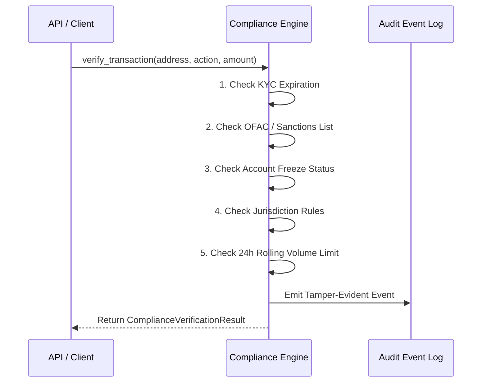

# Stellar-Lend Protocol: Position Simulation, Insurance Marketplace, Compliance, and Reputation

Comprehensive specification, security architecture, smart contract implementation, and API integration guide.

---

## 1. Lending Pool Position Health Simulation Engine

### Mathematical Model

The Health Factor ($HF$) measures the solvency ratio of an open lending position:

$$HF = \frac{\sum_{i=1}^n \left( C_i \times P_i \times LT_i \right)}{\sum_{j=1}^m \left( D_j \times P_j \right)}$$

Where:
- $C_i$: Collateral asset $i$ quantity.
- $P_i$: Price of asset $i$ in USD.
- $LT_i$: Liquidation Threshold of collateral asset $i$ (in basis points, where $100\% = 10,000 \text{ bps}$).
- $D_j$: Total outstanding debt of borrowed asset $j$ (principal + accrued interest).

### Risk Tier Boundaries

| Risk Tier | Health Factor ($HF$) | Condition | Allowed Actions |
|:---|:---|:---|:---|
| **Safe** | $HF \ge 1.50$ ($15,000 \text{ bps}$) | Healthy buffer | Borrow, Withdraw, Collateralize |
| **Caution** | $1.20 \le HF < 1.50$ | Approaching danger | Repay, Deposit Collateral |
| **AtRisk** | $1.00 \le HF < 1.20$ | Critical margin | Repay, Deposit Collateral |
| **Liquidatable** | $HF < 1.00$ ($10,000 \text{ bps}$) | Under-collateralized | Liquidation enabled |

---

## 2. Insurance Marketplace & Reserve Fund

### Underwriting Capacity & Solvency Invariant

The reserve pool maintains an insolvency safeguard where:

$$AvailableReserves \ge ActiveCover \times MinSolvencyRatio$$

Default minimum solvency ratio is set to $150\%$ ($15,000 \text{ bps}$).

### Dynamic Premium Pricing Formula

$$Premium = \frac{Cover \times AnnualRate \times Duration \times RiskMultiplier}{10,000 \times 31,536,000 \times 10,000}$$

Where $AnnualRate = BaseRate + \left( Utilization \times UtilizationMultiplier \right)$.

### Security Measure: Single Payout Cap

To protect the insurance reserve from malicious draining through synthetic or flash crash events:
- Single claim payouts are hard-capped at **25%** of available reserves ($2,500 \text{ bps}$).
- Claims require verifiable proof of bad debt liquidation shortfall.

---

## 3. Institutional Compliance Module

### Tier Matrix

| Tier | Name | Daily Limit | KYC Verification |
|:---|:---|:---|:---|
| Tier 0 | Unverified | $0 | None (Blocked) |
| Tier 1 | Retail Verified | $10,000 | Basic ID Verification |
| Tier 2 | Accredited Investor | $250,000 | Accredited Net Worth / Income |
| Tier 3 | Institutional Qualified | $10,000,000 | Full KYB, AML, Beneficial Ownership |

### Compliance Checks Sequence

---

## 4. Deployer & User Reputation Protocol

### Scoring System

- **Initial Score:** 300 (Bronze).
- **On-Time Repayment:** $+15$ points $+ \min(50, \lfloor Volume / \$10,000 \rfloor)$.
- **Late Repayment:** $-30$ points.
- **Liquidation Event:** $-100$ points penalty.
- **Default Event:** $-250$ points penalty.
- **Decay:** Inactivity $> 90$ days decays score by 25 points per quarter toward baseline 300.

### Tier Perks

| Reputation Tier | Score Range | Max LTV Boost | Borrow APY Discount |
|:---|:---|:---|:---|
| Bronze | 0 – 399 | +0 bps | -0 bps |
| Silver | 400 – 699 | +200 bps (+2%) | -25 bps (-0.25%) |
| Gold | 700 – 899 | +400 bps (+4%) | -50 bps (-0.50%) |
| Platinum | 900 – 1000 | +600 bps (+6%) | -100 bps (-1.00%) |

---

## 5. Performance Benchmarks

- **Simulation Engine:** $> 50,000$ operations/second.
- **Compliance Check:** $< 0.05$ ms per evaluation.
- **Insurance Quoting:** $< 0.02$ ms per quote.
